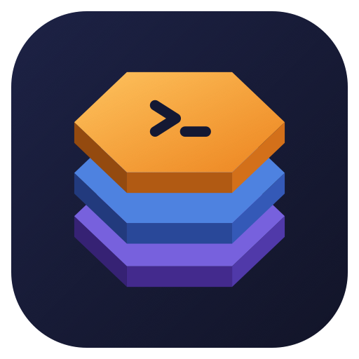

<p align="center">
  
</p>

# kube-context-manager (`kcm`)

Keep Kubernetes profiles and context selection in your shell. Leave a terminal
in production overnight, and KCM returns it to `local` before your next command
runs.

KCM uses **shared kubeconfig files**, **shell environment variables**, and **fzf**.
It does not create per-shell kubeconfig copies or change a source file's
`current-context`. Namespace changes are shared between shells using that context.

## Install

Requires Go 1.25+, [fzf](https://github.com/junegunn/fzf), and zsh or bash 4.4+.
`kubectl` is needed for namespace discovery. No gum or yq dependency.

```sh
git clone https://github.com/mikeoertli/kube-context-manager.git
cd kube-context-manager
make install                     # installs kcm to GOBIN or GOPATH/bin
kcm settings init                # optional; built-in defaults also work
```

Ensure the Go bin directory is on `PATH`. On macOS, `brew install go fzf` provides
the dependencies; `brew install bash` provides a modern bash if desired. Apple's
bundled bash 3.2 does not support KCM's Enter-time expiry integration.

### Shell integration (required for session switching and timeouts)

Add this **after shell plugins and keybindings** in `~/.zshrc`:

```sh
eval "$(kcm init zsh)"
```

For bash, use `eval "$(kcm init bash)"` in `~/.bashrc` and ensure your interactive
login shell sources that file. Open a new shell after setup.

`kcm init zsh` **prints shell code**. The surrounding `eval "$(...)"` runs that
code in your current shell. This is necessary because an ordinary executable
cannot change its parent shell's environment variables.

Evaluating the integration:

- Starts the shell in `local`, clears its context and timeout, and sets
  `KUBECONFIG=/dev/null` until you select a context.
- Defines a `kcm` shell function so profile/context changes, `clear`, and `renew`
  can update this shell's environment.
- Defines `kcmkubectl`, `kcmhelm`, and `kcmk9s` to pass the selected context to
  those clients. Standard client commands are not replaced.
- Installs prompt and Enter-key hooks for expiry reset and command cancellation.
- Runs `kcm doctor --quiet` to check local settings and configs without contacting
  a cluster.

It does not install tab completion. Running `kcm init zsh` without `eval` only
displays the code; it does not initialize the shell or edit your startup file.
Evaluating it again resets that shell to `local` with no context selected.

Standalone commands such as `kcm list`, `kcm install`, and `kcm settings init`
can run without shell integration. Profile/context switching and interactive
timeouts require it.

## Everyday use

Use `kcm list` to list discovered contexts across all configured profiles. Each
section shows its directory, contexts, namespaces, servers, and source files;
empty profiles are included. `*` marks the effective global context that standard
clients would use (`KUBECONFIG`, or `~/.kube/config` when unset). `>` marks this
shell's KCM selection; `*>` means both selections match. Markers also work in
redirected output. The command only reads local files and does not query clusters
or permissions. `kcm contexts` continues to list only the current profile.

```sh
kcm                          # fuzzy-select a local context
kcm profile                  # fuzzy-select a profile for this shell
kcm profile prod             # or select explicitly
kcm context customer-a
kcmkubectl get pods           # supplies --context customer-a
kcmhelm list                  # supplies --kube-context customer-a
kcmk9s                        # supplies --context customer-a
kcm ns                       # choose an existing namespace or create a new one
kcm ns app                   # update this context's shared namespace
kcm ns feature-demo --create  # create in the selected cluster, then switch
kcm status                   # profile, context, namespace, expiry
kcm profile local            # explicitly leave production
```

Every new shell starts in `local`, including a new interactive child shell.
Changing profiles clears the context. **Choose a context before using a client.**
With no selection, `KUBECONFIG=/dev/null` prevents fallback to a shared default
config. Selecting a context sets `KUBECONFIG` to its source file.

Use `kcmkubectl`, `kcmhelm`, and `kcmk9s` to pass this shell's selected context
to the corresponding client. KCM does not define or replace `kubectl`, `helm`,
or `k9s` commands, aliases, or functions. Those commands still inherit
`KUBECONFIG`, but use the source file's `current-context` unless you supply an
explicit context flag. In scripts, use `kcm exec -- kubectl ...` (or `helm`/`k9s`).

If upgrading from the unprefixed wrappers, open a fresh shell after rebuilding
or reinstalling KCM; existing shells retain their previously loaded functions.

| Profile | Default directory | Default timeout |
| --- | --- | --- |
| 🏠 `local` | `~/.kube/` (direct files) | Disabled |
| 🛠️ `dev` | `~/.kube/dev/` | Disabled |
| 🧪 `qa` | `~/.kube/qa/` | Disabled |
| 🚨 `prod` | `~/.kube/prod/` | 8 hours |
| 🌐 `other` | `~/.kube/other/` | Disabled |

Directories are scanned non-recursively. Hidden files, subdirectories, backup
files ending in `~` or `.bak`, and certificate/key files (`.pem`, `.crt`, `.key`)
are excluded. Other regular files must be valid kubeconfigs. Symlinked files
must resolve within their profile directory.

### Returning home after a timeout

The timer starts when you select a context with a timeout. Changing contexts
does not extend an existing deadline; `kcm renew` explicitly restarts it.

- At a **stale prompt**, pressing Enter resets the profile to `local`, clears
  the context and `KUBECONFIG` selection, and **cancels the entire submitted
  command line**. A notice tells you what happened.
- If time expires while a command is running, KCM resets at the next prompt.
- Nothing runs in the background. Credentials are not expired or revoked.
  Running tools and scripts continue normally.

This is an interactive-shell reminder, not an access-control boundary. Custom
widgets that bypass `accept-line`, other shell integrations that replace KCM's
Enter bindings, and commands sent without the normal line editor bypass that
check. KCM does not wrap every client invocation with a timeout gate.

## Import kubeconfigs

```sh
kcm install ~/Downloads/customer.yaml       # interactive wizard

kcm install ./customer.yaml --profile prod \
  --rename-cluster customer-a \
  --rename-user customer-a-support-ro \
  --rename-context customer-a \
  --namespace app --no-prompt

kcm install ./local.yaml --no-prompt        # local endpoint: defaults to local
kcm install ./remote.yaml --profile other --no-prompt --move
kcm install ./bundle.yaml --profile dev --all-contexts --no-prompt --dry-run
```

The wizard selects a source context, destination profile, readable names,
namespace, filename, and copy/move behavior, then shows a confirmation. All
choices have matching flags. Missing rename flags preserve names with
`--no-prompt`; a remote config requires an explicit `--profile`. Interactive
imports suggest `other` for otherwise unclassified remote endpoints.

For multi-context files, use `--context NAME` or `--all-contexts`. A selected
context imports only its referenced cluster and user. Renaming is available
for single-context imports. `--namespace` can apply to every imported context.

Imports never overwrite destination files. They embed referenced certificates
and keys and preserve token-file and exec paths as absolute paths. External
token files and auth helpers must remain available. Copy is the default;
`--move` requires importing every source context, verifies the installed config,
and archives the original under `kube_root/archive/` before removing the source.
New config and archive files have mode `0600`.

## Namespace picker and creation

`kcm context`, `kcm profile`, and `kcm namespace` (alias `ns`) open fzf pickers
when called without a name. The namespace picker queries the selected cluster
and includes **Create new namespace…**. Choose it, enter a name, and KCM creates
the namespace before switching. The name prompt identifies the profile and
context; a blank name or Ctrl-C cancels.

Use `kcm ns NAME --create` to create and switch directly, or `kcm ns --create`
to prompt only for the new name. Creation requires cluster permission. If it
fails (including when the name already exists), the configured namespace stays
unchanged. `kcm ns NAME` only changes the shared config; it neither creates a
namespace nor checks whether it exists. All namespace switches remain shared
between shells using that source context.

## Permissions on demand

```sh
kcm permissions                          # live summary for the selected context
kcm permissions customer-a -n app        # inspect without switching contexts
kcm permissions --details                # full returned rules and restrictions
kcm can-i delete deployments.apps -n app
kcm can-i get pods/my-pod --subresource log -n app
kcm can-i list nodes --context customer-a
```

Checks run only when requested, with no caching or automatic picker/prompt queries.
They use the current profile's contexts and leave shell selection and kubeconfigs
unchanged. Summaries identify their namespace and preserve resource-name restrictions;
incomplete results are labeled. `can-i` exits `0` for allowed, `1` for not allowed,
and `2` for a failed or inconclusive check. See [permission checks](docs/permissions.md)
for scope, options, and limitations.

## Settings and local-only checks

The settings file is `~/.config/kcm/kcm_settings.toml`. See the complete
[example settings](internal/kcm/defaults.toml), which KCM also uses as its defaults.
Override the root, add profiles, choose emoji, or disable a timeout:

```toml
kube_root = "~/kubeconfigs"
local_hosts = ["kubernetes.docker.internal"]
local_cidrs = ["192.168.49.2/32"]

[profiles.prod]
timeout = "0"                 # disabled; normal default is "8h"

[profiles.support]
dir = "support"               # relative to kube_root; absolute paths work too
emoji = "🧰"
timeout = "2h"
```

`localhost` and loopback IPs are local by default. Private network addresses are
not automatically local, and classification never performs DNS lookups. An
omitted timeout defaults to eight hours for `prod` or a selected source under
`kube_root/prod/`; other profiles have no timeout. An explicit profile timeout
takes precedence. Settings changes apply on the next selection or `kcm renew`.

Non-local contexts at the root produce an error until moved or waived:

```sh
kcm doctor
kcm waive deliberately-local-tunnel
kcm waivers
kcm unwaive deliberately-local-tunnel
```

Waivers live in `kube_root/.kcm_waivers` as readable JSON. Each binds to the
context name, canonical source path, and server address. Changing any of those
requires a new waiver. Discovery never relocates files automatically.

Use `KCM_SETTINGS=/path/to/settings.toml` or `--settings PATH` for alternate
settings. For a shell that always uses an alternate file:

```sh
eval "$(kcm --settings /path/to/settings.toml init zsh)"
```

## Completions and Starship

### Tab completion (optional)

Completion teaches the shell which commands, flags, profiles, and contexts to
suggest when you press **Tab**, such as after `kcm profile `. It does not initialize
KCM, select a profile/context, or install expiry hooks.

Add this to `~/.zshrc` after `compinit` (usually run by your shell framework):

```sh
source <(kcm completion zsh)
```

For bash, add `source <(kcm completion bash)` to `~/.bashrc`.
`kcm completion zsh` prints completion code; `source <(...)` loads it into the
current shell. Put both setup lines in your startup file if you want session
integration and completion:

```sh
# ~/.zshrc — after plugins, keybindings, and compinit
eval "$(kcm init zsh)"          # Session state, client wrappers, expiry hooks
source <(kcm completion zsh)    # Tab completion only
```

Fish and PowerShell completion generation is also available; session integration
supports zsh/bash.

### Starship (optional display)

Starship displays KCM's exported shell state. It does not replace initialization
or provide KCM tab completion.

For Starship, use the [suggested config block](docs/starship.md) or copy
[examples/starship.toml](examples/starship.toml) into your `~/.config/starship.toml`.
It replaces the built-in `[kubernetes]` module and old context/user regex rules
with styles based on the profile-to-directory mapping: local green, dev yellow,
qa red, prod magenta, and other orange, with a fallback for custom profiles.

The guide covers custom prompt placement, emoji overrides, and migration from
the previous `[custom.kcm]` snippet. It uses `kcm prompt` for the shell-selected
context and timeout; namespace remains available through `kcm status`.

## Command reference

| Command | Function |
| --- | --- |
| `kcm`, `kcm context [name\|-]` | Select a context; `-` returns to the previous one |
| `kcm profile [name]` | Select this shell's profile |
| `kcm namespace [name] [--create]` | Pick a shared namespace, or create and switch |
| `kcm list` | List contexts grouped by profile, marking global and shell selections |
| `kcm contexts`, `kcm profiles` | List available contexts or profiles |
| `kcm permissions [CONTEXT] [--details]` | Inspect live permissions for one namespace |
| `kcm can-i VERB RESOURCE` | Check one API action without executing it |
| `kcm status`, `kcm prompt` | Detailed status or compact prompt output |
| `kcm clear`, `kcm renew` | Clear selection or restart its timer |
| `kcm install PATH` | Import, rename, copy, or move configs |
| `kcm waive NAME`, `kcm unwaive NAME`, `kcm waivers` | Manage root exceptions |
| `kcm doctor` | Validate settings and config layout |
| `kcm init SHELL`, `kcm completion SHELL` | Generate integration and completions |
| `kcm settings init`, `kcm settings path` | Create or locate settings |
| `kcm exec -- CLIENT ARGS` | Pass the selected context to kubectl, helm, or k9s |
| `kcmkubectl`, `kcmhelm`, `kcmk9s` | Shell wrappers that pass the selected context to each client |
| `kcm version`, `kcm help [COMMAND]` | Version and help |

Every `kcm` command supports `--help`; wrapper arguments pass through to the client.
Aliases: `ctx`, `ns`. See
[complete command help](docs/commands.md) and [behavior details](docs/design.md).

## Development

```sh
make build                  # bin/kcm
make check                  # formatting, vet, unit/integration tests
python3 tests/shell_integration.py ./bin/kcm --bash /path/to/modern/bash --fzf /path/to/fzf
```

Tests use temporary fixture configs and do not contact a Kubernetes cluster.
Go dependencies are pinned in `go.mod` and verified by the committed `go.sum`.
`VERSION` is the sole source of the application's version, embedded at compile
time for Make builds and direct `go build`, `go install`, or `go run` commands.
Update that file and rebuild to change the reported version. No GitHub Actions,
release jobs, or tagging workflow are included.

## Related

Check out my new Kubernetes resource monitor TUI too – [`krm` (kube-resource-monitor)](https://github.com/mikeoertli/kube-resource-monitor).
